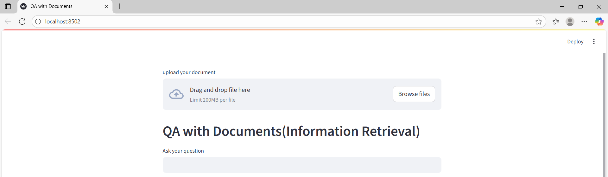
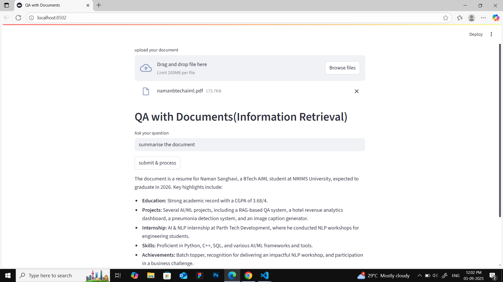

# 📘 QAWithPDF - RAG Based Question Answering System
This project implements a **Retrieval-Augmented Generation (RAG) model** that allows users to upload PDFs and ask questions about their content. It combines **document retrieval** with a **language model** to generate accurate and context-aware answers.

---

## 📂 Table of Contents
1. [Features](#-features)  
2. [Demo](#-demo)  
3. [Installation](#-installation)  
4. [Usage](#-usage)  
5. [Project Structure](#-project-structure)    

---

## ✨ Features
- 📂 Upload and process PDFs for question answering  
- 🔍 Retrieve relevant chunks using embeddings & vector store  
- 🤖 RAG pipeline integrates retrieval with a language model  
- 🌐 Streamlit frontend for interactive Q&A  
- 📊 Logging & exception handling for better debugging  

---

## 🎥 Demo

👉 User Interface of the system
- asking for document for processing it.


- after providing the query.


---

## ⚙️ Installation
1. Clone the repository
    ```bash
    git clone https://github.com/namansanghavi/QAWithPDF.git
    cd QAWithPDF
    ```
2. Create a virtual environment & activate
    ```bash
    python -m venv venv
    source venv/bin/activate    # Mac/Linux
    venv\Scripts\activate       # Windows
    ```
3. Install dependencies
    ```bash
    pip install -r requirements.txt
    ```
4. Setup environment variables
    - Copy .env.example to .env and add your api key (e.g., OPENAI_API_KEY).
    ```
    cp .env.example .env
    ```

---

## ▶️ Usage
Run the Streamlit App
```bash
streamlit run StreamlitApp.py
```

---

## 📂 Project Structure
```
QWE/
├─ QAWithPDF/
│  ├─ __init__.py
│  ├─ data_ingestion.py        # Load & preprocess PDFs
│  ├─ embedding.py             # Embedding & retrieval logic
│  ├─ model_api.py             # RAG pipeline
|  
├─ frontend.py                 # Streamlit frontend
├─ exception.py                # Custom exceptions
├─ logger.py                   # Logging utilities
├─ requirements.txt            # Project dependencies
├─ .env.example                # Example env variables (no secrets)
├─ .gitignore                  # Ignore caches, venv, logs, etc.
└─ README.md                   # This file
```
---
